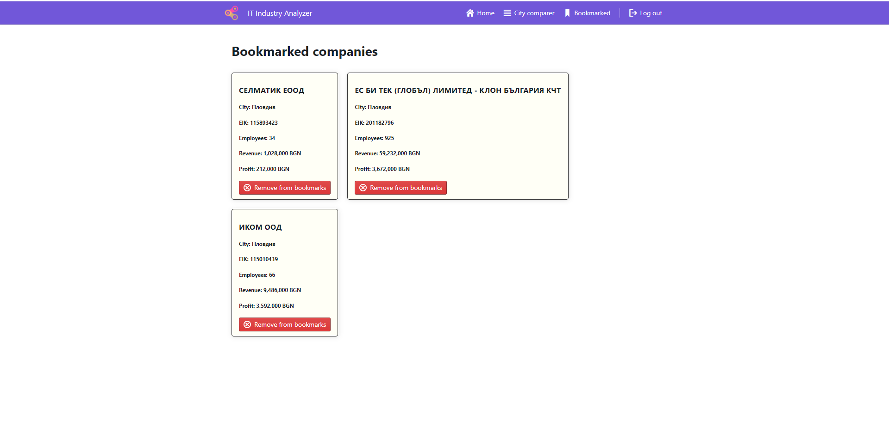

# it-indystry-statistics
Web application showing information about the IT industry development in Bulgaria.
This application shows statistics for all companies in the It industry in Bulgaria. All the information about the companies is from the official
industry map of Bulgaria portal https://www.bgindustrymap.com.
The user can apply different filters, search and see companies basic information such as number of employees, profit e.t.c. + save favorite companies as bookmarks.

The application is build with Node.js and Express + MongoDb and Mongoose on the back-end. For the front-end the main technology is React.js + Styled components + Chart.js. 
Client side code is bundled with Parcel.

**The server side code is deployed on Heroku.**  
**The client side code is hosted on Vercel on the following address: https://it-industry-statistics-client.vercel.app/**

# Application Preview

Registration and Login + Error handling

Filter companies by city, company size, company profit and company name

Compare the It industry statistics between cities

Save companies as bookmarks

